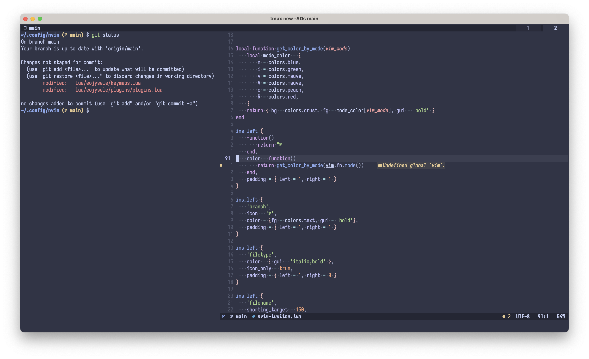

# Dotfiles

## Installation

### zsh

Required: oh-my-zsh.

```shell
ln -s ~/.config/dotfiles/ej.zsh-theme ~/.oh-my-zsh/custom/themes/ej.zsh-theme

ln -s ~/.config/dotfiles/zshrc ~/.zshrc
```

### Alacritty

```shell
# use for macos
ln -s ~/.config/dotfiles/alacritty/macos.yml ~/.config/alacritty/alacritty.yml

# use for linux
ln -s ~/.config/dotfiles/alacritty/linux.yml ~/.config/alacritty/alacritty.yml
```

### Tmux

```shell
ln -s ~/.config/dotfiles/tmux.conf ~/.tmux.conf
```

### kitty

```shell
ln -s ~/.config/dotfiles/kitty/kitty.conf ~/.config/kitty/kitty.conf

ln -s ~/.config/dotfiles/kitty/colors.conf ~/.config/kitty/colors.conf

# use for macos
ln -s ~/.config/dotfiles/kitty/macos.conf ~/.config/kitty/macos.conf

# use for linux
ln -s ~/.config/dotfiles/kitty/linux.conf ~/.config/kitty/linux.conf
```

## Showcase

1. Alacritty + tmux + [neovim](https://github.com/eojysele/nvim-config)



2. kitty


