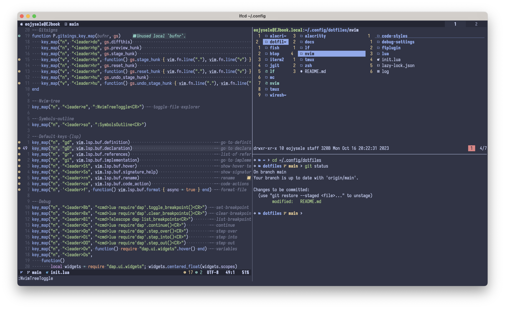

# Dotfiles

## Requirements
- Alacritty >= 0.12.2
- tmux >= 3.3
- zsh >= 5.9 (also requred oh-my-zsh)
- Neovim >= 0.9.1
- lf >= 30

## Installation

### zsh

```shell
ln -s ~/.config/dotfiles/zsh/eojysele.zsh-theme ~/.oh-my-zsh/custom/themes/eojysele.zsh-theme

ln -s ~/.config/dotfiles/zsh/zshrc ~/.zshrc
```

### Tmux

```shell
ln -s ~/.config/dotfiles/tmux/tmux.conf ~/.tmux.conf
```

### Neovim

```shell
ln -s ~/.config/dotfiles/nvim ~/.config/nvim
```

### kitty

```shell
ln -s ~/.config/dotfiles/kitty/kitty.conf ~/.config/kitty/kitty.conf
ln -s ~/.config/dotfiles/kitty/colors.conf ~/.config/kitty/colors.conf

# use for macos
ln -s ~/.config/dotfiles/kitty/macos.conf ~/.config/kitty/os.conf
ln -s /Applications/kitty.app/Contents/MacOS/kitten ~/.local/bin

# use for linux
ln -s ~/.config/dotfiles/kitty/linux.conf ~/.config/kitty/os.conf
```

### Alacritty

```shell
ln -s ~/.config/dotfiles/alacritty/alacritty.yml ~/.config/alacritty/alacritty.yml

ln -s ~/.config/dotfiles/alacritty/colors.yml ~/.config/alacritty/colors.yml

# use for macos
ln -s ~/.config/dotfiles/alacritty/macos.yml ~/.config/alacritty/os.yml

# use for linux
ln -s ~/.config/dotfiles/alacritty/linux.yml ~/.config/alacritty/os.yml
```

### lf

```shell
ln -s ~/.config/dotfiles/lf ~/.config/lf
```

## Showcase


